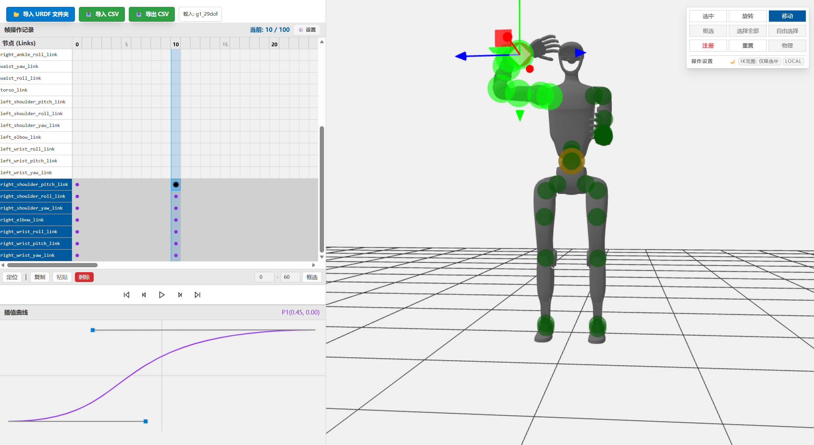
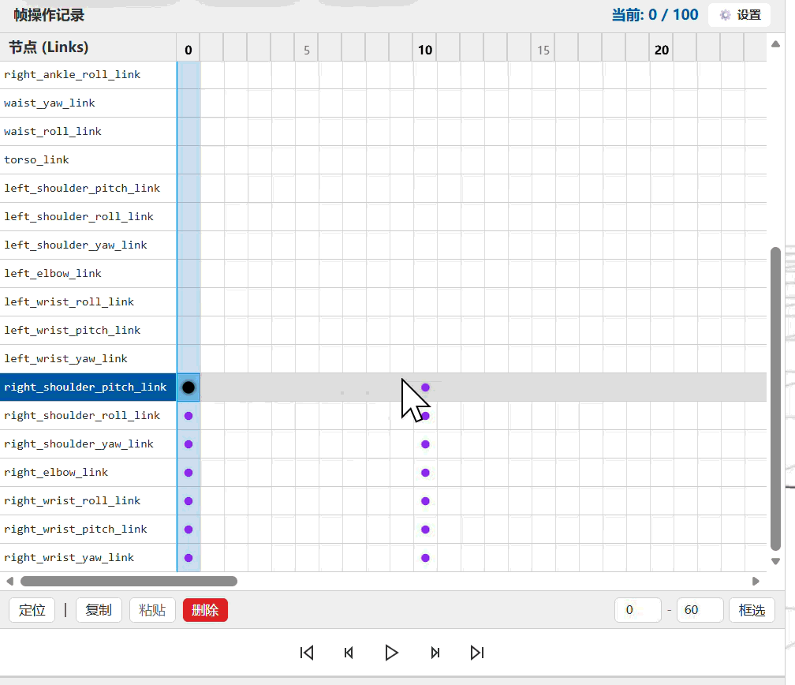

# MMMimic Studio 🤖

**MMMimic Studio** 是基于React制作的MMDLike 机器人CSV动作数据编辑器。



## ✨ 核心特性

* 🤖URDF导入，任意机器人形态，支持限位限制
* ✨CSV导入/导出
* #️⃣MMDLike关键帧编辑/注册，支持贝塞尔曲线自由调控补间曲线

## 🚀 快速开始 (Quick Start)

### 1. 本地运行 (Local Development)

本项目基于 `Vite` + `React` + `Three.js` + `TailwindCSS` 构建。

```
# 克隆仓库
git clone [https://github.com/你的用户名/mmd-robot-editor.git](https://github.com/你的用户名/mmd-robot-editor.git)
cd mmd-robot-editor

# 安装依赖
npm install

# 启动开发服务器
npm run dev
```

### 2. 在线demo

[MMMimic Studio On DFTServer](https://mstudio.dftserver.top/)

## 📖 使用指南

### 📂 加载机器人


1. 点击左上角  **「📂 导入 URDF 文件夹」** 。
2. 选中你本地电脑中包含机器人 `.urdf` 文件和相应 `meshes/` 的 **整个根目录** 。
3. *Tip: 如果文件夹内包含多个 URDF 变体（如 `xx_flipped.urdf`），系统会自动弹出智能选择菜单。*

### 🎮 操作骨架

使用左键调整视角，右键移动视角。选中模式下无法调整视角，只能移动视角。

<table>
    <thead>
        <tr>
            <th colspan="3">选中模式</th>
            <th>旋转模式</th>
            <th colspan="2">移动模式</th>
        </tr>
    </thead>
    <tbody>
        <tr>
            <td>
                <image src="image/README/Select_1.gif"><br><center>框选模式</center>
            </td>
            <td>
                <image src="image/README/Select_2.gif"><br><center>自由选择模式</center>
            </td>
            <td>
                <image src="image/README/Select_3.gif"><br><center>全部选中</center>
            </td>
            <td>
                <image src="image/README/Rotate_1.gif"><br><center>旋转模式</center>
            </td>
            <td>
                <image src="image/README/Move_1.gif"><br><center>局部IK</center>
            </td>
            <td>
                <image src="image/README/Move_2.gif"><br><center>整体IK</center>
            </td>
        </tr>
        <tr>
            <td>
                选中指定一片骨骼/链条进行操作
            </td>
            <td>
                逐个选择骨骼进行操作，再次单击取消
            </td>
            <td>
                单次点击，选择全部骨骼
            </td>
            <td>
                旋转模式，按限位进行单个骨骼旋转
            </td>
            <td>
                局部IK，移动选中电机链的底部骨骼<br>自动计算角度在选中链条上的传播
            </td>
            <td>
                整体IK，移动选中单个骨骼的位置<br>自动计算本条链直到Base Link的所有骨骼的角度传播
            </td>
        </tr>
    </tbody>
</table>

* **选中模式** ：可点击视图中的绿色/橙色控制球，或在时间轴左侧直接点击骨骼名称。支持**鼠标框选**批量选中。
* **旋转模式 (FK)** ：仅显示当前关节真实可转动的环（如单轴合页仅显示一条线）。
* **移动模式 (IK)** ：在末端生成红色拖拽点，自动向上追溯解算姿态。
  * 右下角可切换 `IK范围: 全局(链式)` 或 `仅限选中(局部)` 以控制骨骼联动的深度。

### ⏱️ 时间轴与关键帧

时间轴面板位于界面左上侧，用于管理和编排整个动画序列：

<center></center>

* **注册关键帧** ：在右侧 3D 视图中调整好机器人姿态后，点击 `注册` 按钮，系统会立刻在当前游标所在帧、为当前选中的骨骼（以及受 IK 影响的关联骨骼）打上关键帧标记（红色圆点）。

<center></center>

* **范围框选** ：支持在时间轴的 Canvas 区域内 **按住鼠标拖拽** ，拉出一个半透明蓝色选区，以同时选中多个骨骼和跨越多帧的关键帧。也可使用底部栏的精确数值框选功能。

<center></center>

* **批量操作** ：选中区域后，点击底部的 `复制`，移动游标到目标帧，再点击 `粘贴`，即可将复杂的步态片段完美复用到新位置。同样支持一键 `删除`。

<center></center>

* **播放，暂停与定位** : 支持播放控制、定位上下帧或移动视图。(使用Canvas动态渲染关键帧，高频数据不会卡)

### 📈 插值曲线编辑

曲线编辑器位于界面左下角，贝塞尔曲线调整方式：

<center></center>

* **激活条件** ：在时间轴上点击选中**任意非 0 帧**的已存在关键帧，即可点亮曲线编辑器。
* **控制缓动 (Easing)** ：该曲线定义了从**上一个关键帧**过渡到**当前关键帧**的插值速率。
* 拖拽画布中的 `P1` 和 `P2` 控制点，可以轻松调出“缓入”、“缓出”、“先快后慢”等非线性运动节奏，让机器人动作告别死板的匀速运动，呈现出极具生命力的动态表现。

### 📥/📤 导入与导出 CSV

用于对接算法跑出来的步态数据，第一行可包含表头。
 **数据列格式要求** ：
1-3列：Base Link 世界坐标 `(x, y, z)`
4-7列：Base Link 四元数姿态 `(qx, qy, qz, qw)`
8~N列：活动关节的角度（弧度值 Radian），顺序严格依据导入时 URDF 中关节的声明顺序。

## 📜 许可证

MIT License.
